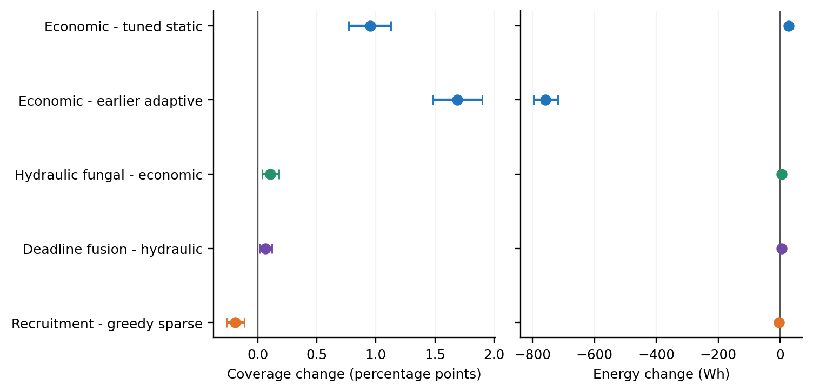

# USV swarm formation research — v3

**A reproducible simulation study of how six surface vessels can change formation
to deliver fresh sensing reports while paying for movement.**

Start with the [paper](paper/main.pdf), [computer setup guide](docs/RUN_ON_YOUR_COMPUTER.md),
or [plain-language group briefing](docs/GROUP_BRIEF.md). The LaTeX source, figures,
raw episode records, paired statistical analysis, controller code and learning
checkpoints are included. This is a research prototype, not a field-validated
navigation system or an accepted journal paper.

## Main findings

The main test contains **960 one-hour simulated missions**: 20 paired seeds,
three scenarios, two radio profiles and eight policies. Static formation radii
were selected using **384 separate development missions**. A further **508
diagnostic missions** check mechanisms, energy price and model sensitivity.

| Policy | Delivered coverage | Fleet energy per mission |
|---|---:|---:|
| Outer fixed ring | 59.49% | 363.7 Wh |
| Development-selected static ring | 65.17% | 426.2 Wh |
| Earlier adaptive controller | 64.44% | 1,212.3 Wh |
| **Economic local controller** | **66.13%** | **454.3 Wh** |
| Hydraulic fungal proposals | 66.24% | 459.9 Wh |
| Deadline-dependent fusion | 66.30% | 464.6 Wh |
| Immediate sparse recruitment | 65.19% | 429.0 Wh |
| Ant-inspired recruitment | 65.00% | 426.3 Wh |

These means weight the six hardware/scenario conditions equally. The main
engineering improvement is the economic controller: **+1.69 percentage points
of coverage and 62.5% less energy** than the earlier adaptive method. Against
the stronger tuned static formation it gains **0.95 points**, costing **28.1 Wh**
more. The 95% paired interval for that coverage gain is **0.77 to 1.13 points**.

Biological additions are small: hydraulic proposals add 0.11 points over the
economic controller, and deadline fusion adds another 0.07 points. Ant-inspired
recruitment loses 0.19 points against immediate sparse recruitment. The report
includes diagnostic results and uncertainty; none establishes biological
superiority in real vessels. Start new practical experiments with `economic`.
The biological gains are also **not robust across the diagnostic settings**:
changed sensing/correlation makes their intervals include zero, and deadline
fusion loses 0.67 points against hydraulic fusion in the slower-priority check.



## Install and run

Open Anaconda Prompt in this project root (the folder containing this README):

```bat
conda create -n usv-research python=3.12 -y
conda activate usv-research
python -m pip install -r requirements-tested.txt
python -m pip install -e . --no-deps
python -m unittest discover -s tests -v
```

Run 16 new missions and measure your own computer:

```bat
python -m usv_research.experiment --config configs/short_radio.json --control configs/control_short.json --out results/my_pilot --policies static_tuned economic fungal deadline_fusion --scenarios storm moving_front --seeds 2 --seed-start 9000 --workers 2 --trace
python -m usv_research.analyze results/my_pilot --out results/my_pilot_analysis
python scripts/plot_experiment.py results/my_pilot --out results/my_pilot_analysis
python scripts/estimate_runtime.py results/my_pilot --episodes 480
```

No GPU is needed. Run multiprocess commands in a terminal, outside Spyder's
interactive console. Repeating an identical experiment command retains completed
episodes; changed causal code or settings require a new output directory.
More simulation seeds improve confidence in an estimate, not the controller itself.

## Rebuild the released study and paper

The released raw results are sufficient to rebuild every reported figure without
running the simulations again:

```bat
python -m usv_research.analyze results/main_nominal results/main_short --out results/analysis_main
python scripts/make_paper.py
python scripts/make_supplement.py
python scripts/verify_release.py
```

To run the frozen experiment suite, use:

```bat
python scripts/reproduce_study.py --suite all --workers 4
```

Existing matching records are reused, so this command completes immediately for
already finished jobs. For a fresh physical rerun, work in a separate extracted
copy and move its corresponding `results/main_*` and diagnostic directories
elsewhere first. Keep the original released data as a reference. Static-selection
commands are in `docs/REPRODUCIBILITY.md`.

Compile the manuscript with an installed TeX distribution (TeX Live or MiKTeX):

```bat
cd paper
latexmk -pdf -interaction=nonstopmode -halt-on-error main.tex
```

The compiled PDF is already supplied; reading it needs no Python or LaTeX.

## Learning that you can continue

See [RL_EXPERIMENT.md](docs/RL_EXPERIMENT.md) for exact training, continuation,
evaluation and timing instructions. Both paths have been executed:

* **NumPy REINFORCE:** 50 training episodes, 18 paired evaluation missions per
  policy, then a five-episode resume check. The evaluated learner saved energy
  but lost coverage and did not improve the evaluation objective.
* **PPO:** environment validation, 512 training steps, saved-model continuation
  for 128 additional steps, then two complete evaluation missions. This is a
  software smoke test; 640 steps do not establish learning effectiveness.

The learned residual selects movement step and energy price around the economic
controller. It receives recent cached observations, not the simulator's private
true sensor-health parameters. The evaluated 50-episode native checkpoint is
retained separately from the resumed 55-episode checkpoint.

## Scientific scope and limits

The outcome is the priority-weighted fraction of annular monitoring reports
received within 30 seconds. It is not disk-area coverage, correct classification,
continuous tracking or guaranteed radio connectivity. The economic controller's
pooled instantaneous all-node connectivity is about 38.9%; opportunistic cached
delivery can still improve. A continuously connected swarm would require an
additional, feasible connectivity constraint.

Shared sensor visibility, correlated channel fades, one-hop-per-round forwarding,
delayed telemetry and commands, finite vessel response, and movement energy are
modeled. Sensor/radio curves and the power law are synthetic. Packet contention,
finite network throughput, calibrated radar clutter, realistic seakeeping and
COLREGs are not included. No physical sea-state or mast-height optimum is inferred.

The new research candidate is the **deadline-dependent reinforcement of links
inside costed, physically executed formation changes**. Fungal and ant analogies,
coverage control, hydraulic networks and the underlying Bernoulli sensitivity
identity all have prior art. The [source ledger](docs/SOURCE_LEDGER.md) identifies
what was transferred and what novelty has not been established. See the paper
for the mathematical derivation, exact small-network checks and complexity.

## Repository map

| Path | Purpose |
|---|---|
| `usv_sim/` | Physical/sensing/network simulator and inherited v2 methods |
| `usv_research/` | New controllers, experiment runner, analysis and residual learning |
| `configs/` | Frozen physical and controller settings |
| `tests/` | Causality, probability, derivatives, movement cost and learning-resume checks |
| `scripts/` | Study reproduction, figure generation, runtime estimates and release verification |
| `results/` | Raw runs, manifests, timing, summary tables and learning checkpoints |
| `paper/` | LaTeX source, bibliography, generated scientific figures and compiled paper |
| `docs/` | Setup, protocol, research sources, group briefing and reproducibility notes |

Before a public release, the group should review authorship, institutional/IP
requirements and the proposed MIT license. Third-party course slides and downloaded
research papers are not redistributed. No GitHub repository has been published by
this package. See the setup guide for `git init`, commit and push instructions.
